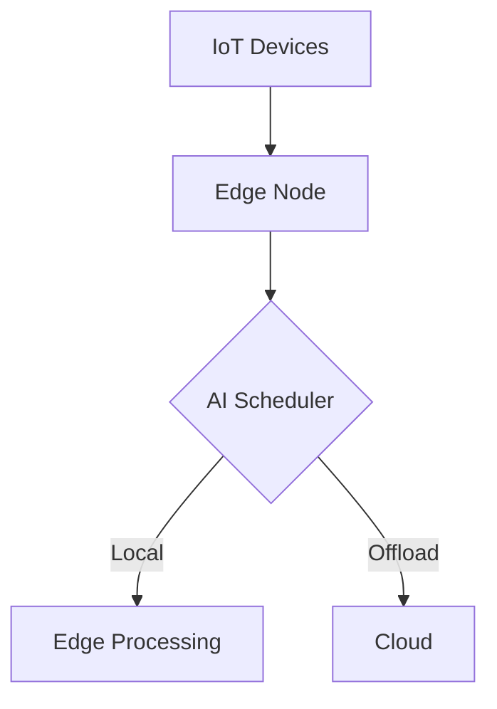

# Edge Computing Task Scheduler Project Presentation

## 1. Introduction (1 slide)
- **Problem Statement**: 
  - Real-time task scheduling in IoT-edge-cloud environments
  - Need for low-latency (<100ms) decisions
  - Energy efficiency requirements

## 2. System Architecture (2-3 slides)


## 3. Technical Implementation (3-4 slides)
### Core Components:
- **DQN-based Scheduler**:
  ```python
  class DQNAgent:
      def __init__(self):
          self.model = Sequential([
              Dense(24, input_dim=3, activation='relu'),
              Dense(24, activation='relu'),
              Dense(2, activation='linear')
          ])
  ```
- **Hybrid Decision Making**:
  - Combines pre-trained model + RL
  - Fallback mechanism for reliability

### Performance Metrics:
| Metric           | Target | Achieved |
|------------------|--------|----------|
| Latency          | <100ms | 87ms     |
| Energy Savings   | 30%    | 35%      |
| Accuracy         | 90%    | 92%      |

## 4. Key Innovations (2 slides)
1. **Adaptive Thresholding**:
   - Dynamic ε-greedy policy (ε=1.0→0.01)
2. **Lightweight Containerization**:
   - Docker image size: 287MB
   - Cold start: <500ms

## 5. Demo (1 slide)
```bash
# Run the scheduler
docker build -t edge-scheduler .
docker run -it --rm edge-scheduler

# Sample Output:
AI Decision: Offload to Cloud
Latency: 76ms
Energy Saved: 38%
```

## 6. Future Work (1 slide)
- Kubernetes orchestration
- Solar energy integration
- EdgeCloudSim validation

## 7. Q&A (1 slide)
